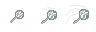
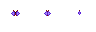
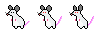
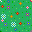

# TERMINAL_PROTOCOLS / PHASE_01 // NAVIGATION 

> **Дата:** 22.09.2026  
> **Автор (ФИО):** Гайко-Авдеев Андрей Константинович и Красюков Дмитрий Александрович

## ОПИСАНИЕ
Напишите описание вашей работы 

## СОЗДАННЫЕ АССЕТЫ

### 1. Персонаж и Враг
* **Игрок**: Котя с сачком 
* **Враг**: Мышь усатая
* **Анимация**: Состоит из 2-3 кадров.

### 2. Окружение
* Создан тайл поляны и бабочки.
* Создан предмет для сбора: бабочки.

## ПРЕВЬЮ ГРАФИКИ

